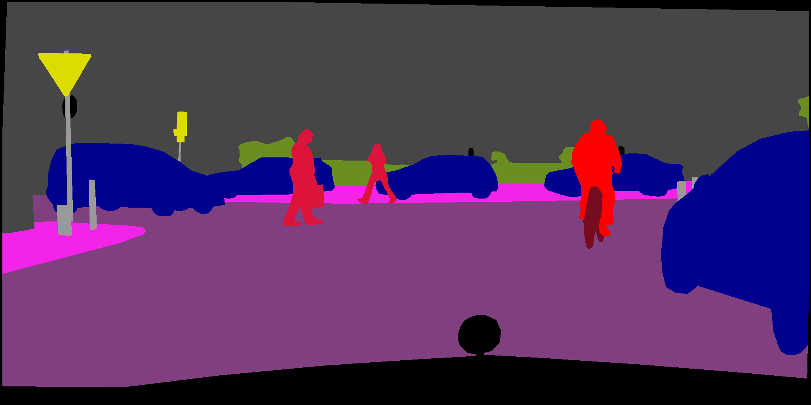
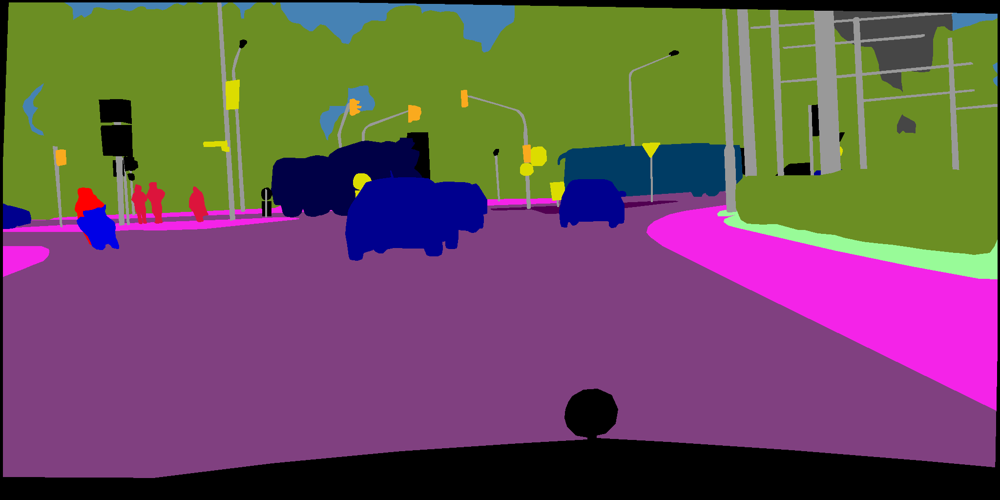
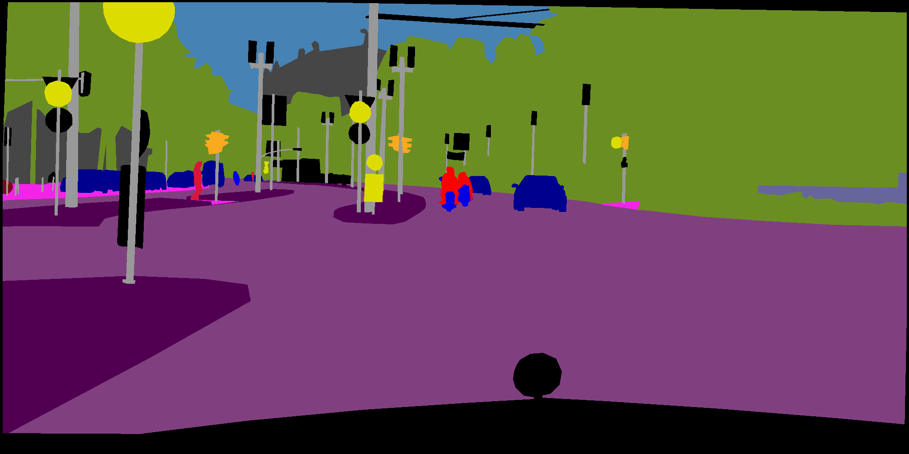

__Hierarchical Semantic Segmentation__ is a robust and customizable semantic segmentation system. It is based on dense convolutional neural networks and TensorFlow. The system is described in the following paper. If you use our work, _please refer to this paper and GitHub repository._

__Meletis P, Dubbelman G (2018)__ _Training of convolutional networks on multiple heterogeneous datasets for street scene semantic segmentation._ The 29th IEEE Intelligent Vehicles Symposiom (IV 2018), [full paper on arXiv](https://arxiv.org/abs/1803.05675).

# Introduction ###

Hierarchical Semantic Segmentation is based on ResNet50. Its main novelty compared to other semantic segmentation systems, is that a single model can handle a variety of different datasets, with disjunct sets of semantic classes. Our system also runs in real time (15fps and rising).

 |  | 
----|----|----
 |  | 
 |  | 
